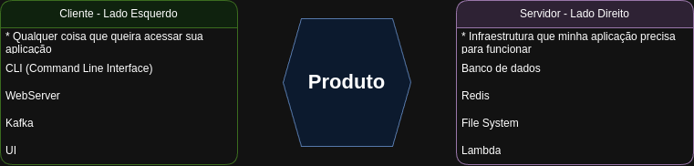

# Projeto GO-HEXAGONAL

## Ideia do Projeto

Este projeto tem como objetivo demonstrar a arquitetura hexagonal (ports and adapters) em um projeto extremamente simples com GoLang.

**Observação**: O código foi escrito de forma didática, focando na simplicidade e na demonstração dos adaptadores em um contexto de manutenção de produtos, sem a preocupação com reutilização ou boas práticas de desenvolvimento.

## Arquitetura Hexagonal

A arquitetura hexagonal (ou ports and adapters) é um estilo arquitetural que organiza o código para isolar a lógica de negócio do sistema, mantendo-a independente de implementações externas, como bancos de dados, interfaces de usuário ou frameworks. Ela utiliza "portas" e "adaptadores" para permitir que diferentes componentes interajam com o núcleo da aplicação sem modificar sua lógica central, facilitando testes e adaptações a novos requisitos.

- Não impõe uma estrutura rígida para criação de pastas.
- Não dita regras sobre como você deve desenvolver seu código.
- Permite o uso de frameworks, desde que eles não guiem o desenvolvimento misturando regras da aplicação com código do framework.
- Requer abstrações claras para que adaptadores possam ser adicionados sem modificar o código "core" de negócio.

Exemplo de organização de uma Arquitetura Hexagonal:



## Estrutura de Pastas

```plaintext
go-hexagonal/
│
├── adapters/           # cliente e servidor
│   ├── cli/
│   ├── db/
│   └── web/
│
├── application/        # core da regra de negócio
│
└── cmd/                # criado pela biblioteca cobra-cli para acesso à aplicação via CLI
```

## O que foi usado no Projeto

- **GoLang 1.18.10** - Linguagem de programação utilizada.
- **Negroni v1.0.0** - Middleware para manipulação de requisições HTTP.
- **Mock v1.6.0** - Biblioteca para criação de mocks em testes.
- **Mux v1.8.1** - Router para manipulação de rotas HTTP.
- **Go-sqlite3 v1.14.24** - Driver para SQLite, usado como banco de dados.
- **Go.uuid v1.2.0** - Biblioteca para geração de UUIDs.
- **Cobra v1.8.1** - Framework para criação de CLI.
- **Testify v1.9.0** - Framework para assertions em testes.
- **Docker** - Para containerização do ambiente de desenvolvimento.

## Como Rodar o Projeto

1. Clone o repositório
2. Construa o ambiente Go no Docker:
   ```bash
   $ docker build .
   ```
3. Execute o container:
   ```bash
   $ docker compose up -d
   ```
4. Acesse o container:
   ```bash
   $ docker exec -it appproduct /bin/bash
   ```
5. Instale as dependências descritas no `go.mod`:
   ```bash
   $ go mod tidy
   ```
6. Crie o banco de dados e a tabela `Produto`:
   ```bash
   $ touch sqlite.db
   $ sqlite3 sqlite.db
   $ create table products(id string, name string, price float, status string);
   $ .tables  # Verifique se retorna a tabela products
   $ .quit
   ```

## Executar a Aplicação em Modo CLI

```bash
$ go run main.go cli
```

Exemplo de requisição em CLI:
```bash
$ go run main.go cli -a create -n "Product Cli Test" -p 25.6
$ go run main.go cli -a get -i e2b0875a-18e8-483c-9970-156ebb36146f
```

## Executar a Aplicação em Modo HTTP

```bash
$ go run main.go http
```

Exemplos e coleções disponíveis no arquivo de collection do Postman em:
`/docs/go-hexagonal.postman_collection.json`

## Comandos Úteis

- **Iniciar o Projeto**
  ```bash
  $ go mod init github.com/rodrigospimentacwb/go-hexagonal
  ```

- **Executar Testes**
  ```bash
  $ go test ./...
  ```

- **Criar Mock a partir das Interfaces**
  ```bash
  $ mockgen -destination=application/mocks/application.go -source=application/product.go application
  ```

- **Iniciar `cobra-cli` e Criar Comandos** (para usar comandos de terminal para chamar a aplicação)
  ```bash
  $ cobra-cli init
  $ cobra-cli add cli
  ```
